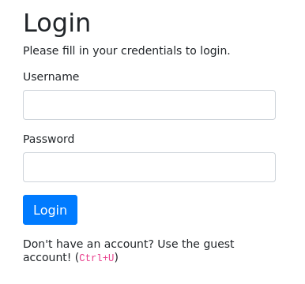
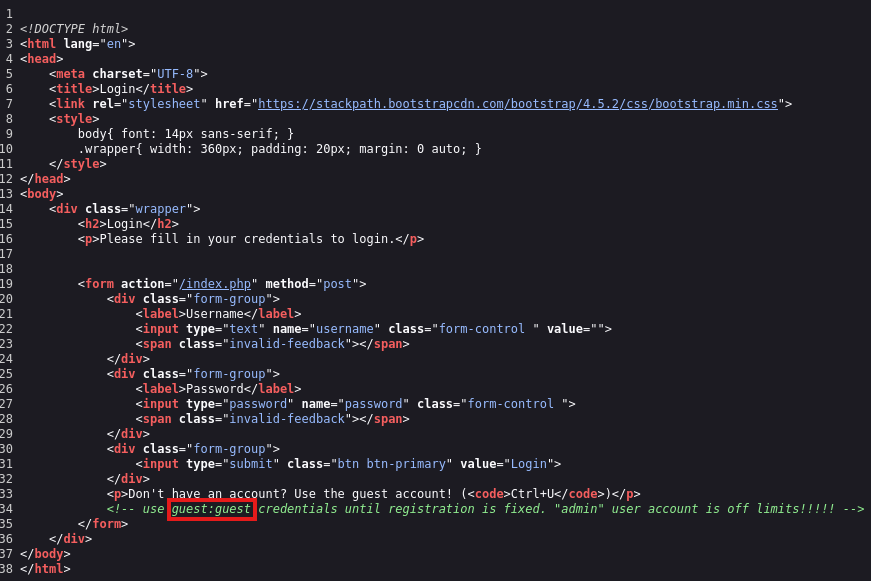
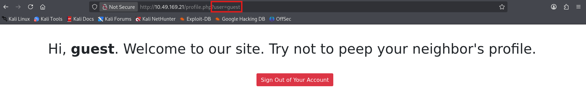
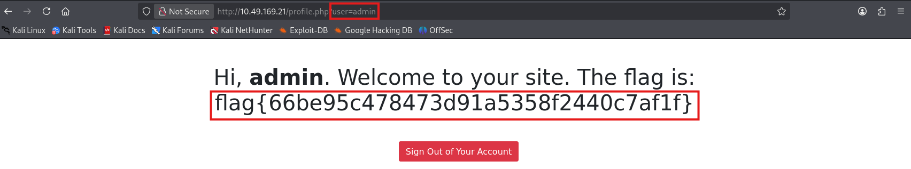

# Title
Insecure Direct Object Reference (IDOR) on User Profile Endpoint

# Risk Rating
High 

*Note: While IDOR can often be Critical, the impact here is restricted to Information Disclosure of other user credentials/secrets within the platform context.*

# Summary
An **Insecure Direct Object Reference (IDOR)** vulnerability was discovered in the web application. An authenticated user can view the profile information and sensitive data of other users by simply modifying the `user` parameter in the URL. This allows for unauthorized information disclosure, potentially leading to full account takeover if administrative credentials or session tokens are exposed.

# Background
IDOR occurs when an application provides direct access to objects based on user-supplied input. In this case, the application uses a predictable identifier (a username) in the URL to fetch user-specific data. Because the server fails to perform an authorization check to verify if the requesting user has the rights to access the requested object, any logged-in user can "neighbour" into other accounts by changing the username in their browser's address bar.

# Technical Details & Evidence

## 1.0 Initial Access
The application presents a login page.



By inspecting the page source code (Ctrl+U), developer comments were found revealing valid testing credentials: `guest:guest`. The comments also explicitly warned that the `admin` user account was "off limits," which highlighted it as a primary target for testing. In this case, valid credentials for a low-privileged user (e.g. `guest`) were used to gain initial access.



## 2.0 Vulnerability Identification
Upon logging in with the guest credentials, the application redirected to a profile page. The URL structure was observed to be:
```
http://<TARGET_IP>/profile.php?user=guest
```


## 3.0 Exploitation
By observing the URL structure, the `user` parameter was identified as a potential vector. The `user` parameter was manually manipulated in the browser's address bar. Changing the value from `guest` to `admin` bypassed any intended access restrictions.



### Request
```
GET /profile.php?user=admin HTTP/1.1
```

### Response
The server returned the profile page and sensitive information (the flag/secret) belonging to the `admin` user.

# Impact
An attacker with a standard account can access the private data of every other user registered on the system, including administrators. In a real-world scenario, this could include:
- Personally Identifiable Information (PII).
- Cleartext passwords or password reset tokens.
- Internal system configurations or "sniffed" network data as suggested by the application's context.

This vulnerability breaks the fundamental security principle of **Least Privilege**.

# Remediation Advice
### 1.0 Implement Object-Level Access Control (Primary Fix)
The application must verify that the currently authenticated session belongs to the user being requested. 

**Example:**
```php
session_start();
$requested_user = $_GET['user'];
// Check if the session user matches the requested user
if ($_SESSION['username'] !== $requested_user) {
    header('HTTP/1.1 403 Forbidden');
    exit("Unauthorized Access.");
}
```

### 2.0 Use Indirect Reference Maps
Instead of exposing database keys or usernames directly in the URL, use cryptographically strong, non-enumerable UUIDs or temporary session-based tokens to reference user objects.

### 3.0 Global Authorization Filter
Implement a centralized authorization component that checks permissions for every request to a sensitive resource, rather than relying on manual checks on every individual page.

# References
- [TryHackMe | Neighbour](https://tryhackme.com/room/neighbour)
